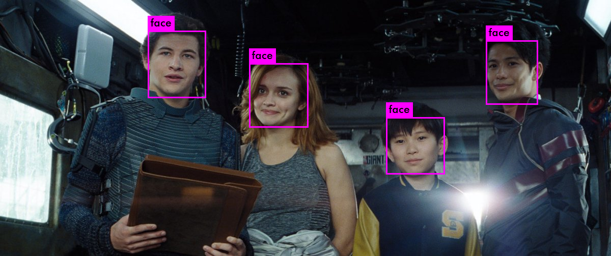
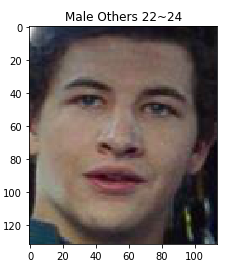
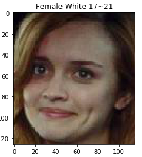
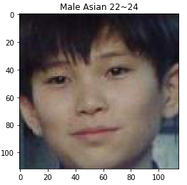
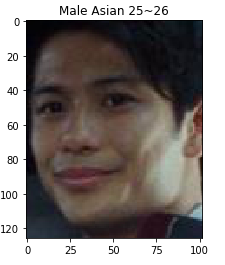
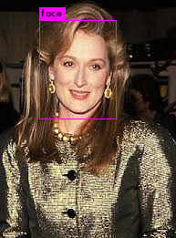
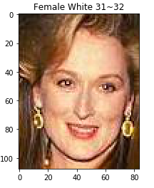

# EE285-Team-Calexy
A cunstomized combination of age/race/gender classifier based on VGG16 and human face detector based on YOLOv3.





## Testing precedure
### Installing The Base darknet

First clone our git repository here. This can be completed by:
```
git clone https://github.com/MichaelHanJ/EE285-Team-Calexy.git
cd EE285-Team-Calexy
make clean
make
```
We assume that you are using GPUs to run this program, but if you want to run only with CPUs, you need to make some revisions on `Makefile`, where you need to change the first line into:
```
GPU = 0
```
If you want to compile with OpenCV, you should change the 2nd line of the 'Makefile' to read:
```
OPENCV=1
```
After you complete all the changes, you can refresh your Makefile by:
```
make clean
make
```
If this works, you will see a whole bunch of compiling information fly by:
```
mkdir -p obj
gcc -I/usr/local/cuda/include/  -Wall -Wfatal-errors  -Ofast....
gcc -I/usr/local/cuda/include/  -Wall -Wfatal-errors  -Ofast....
gcc -I/usr/local/cuda/include/  -Wall -Wfatal-errors  -Ofast....
.....
gcc -I/usr/local/cuda/include/  -Wall -Wfatal-errors  -Ofast -lm....
```
If you have any errors, try to fix them according to given hints. If everything seems to have complied correctly, you can try to run it by:
```
./darknet
```
You should get the output:
```
usage: ./darknet <function>
```
Now, you are ready to play with this custimoized YOLOv3 network for human face detection.
### Detection Using A Pre-Trained Model
We have trained YOLOv3 and YOLOv3 models. You will have to download the pre-trained weight file [here](https://drive.google.com/file/d/1wDD2I4vNO7U5FDoXKz9JM8P8xf498kwz/view?usp=sharing) for YOLOv3 model. Or just run the following codes to get the pre-trained weights saved in Google Drive. `gdrive_download()` is a function to download file from Google Drive.
```
function gdrive_download () {
  CONFIRM=$(wget --quiet --save-cookies /tmp/cookies.txt --keep-session-cookies --no-check-certificate "https://docs.google.com/uc?export=download&id=$1" -O- | sed -rn 's/.*confirm=([0-9A-Za-z_]+).*/\1\n/p')
  wget --load-cookies /tmp/cookies.txt "https://docs.google.com/uc?export=download&confirm=$CONFIRM&id=$1" -O $2
  rm -rf /tmp/cookies.txt
}

gdrive_download 1wDD2I4vNO7U5FDoXKz9JM8P8xf498kwz yolo-obj.weights
```
Please make sure the weight file is stored in the EE285-Team-Calexy folder. All the testing images are saved in `testexample` folder.
Then run the detector!
```
./darknet detector test testexample/test_1.JPEG cfg/yolo-obj.cfg yolo-obj.weights
```
You will see some outputs like this:
```
layer     filters    size              input                output
    0 conv     32  3 x 3 / 1   416 x 416 x   3   ->   416 x 416 x  32  0.299 BFLOPs
    1 conv     64  3 x 3 / 2   416 x 416 x  32   ->   208 x 208 x  64  1.595 BFLOPs
    2 conv     32  1 x 1 / 1   208 x 208 x  64   ->   208 x 208 x  32  0.177 BFLOPs
    ......
    104 conv    256  3 x 3 / 1    52 x  52 x 128   ->    52 x  52 x 256  1.595 BFLOPs
    105 conv     18  1 x 1 / 1    52 x  52 x 256   ->    52 x  52 x  18  0.025 BFLOPs
    106 yolo
Loading weights from yolo-obj.weights...Done!
Enter Image Path: 
```
You need to enter image path again:
```
Enter Image Path: testexample/test_1.JPEG
```
You will get some outputs like:
```
testexample/test_1.JPEG: Predicted in 0.419771 seconds.
face: 100%
43 22 127 130
Image Path saved in cropped_images/image_path.txt
Enter Image Path: 
```
This network prints out the objects detected, the confidence, cooridinates for box and how long it took to find them. The detected result with bounding box is saved to `predictions.png` file. You can check it out in the `EE285-Team-Calexy` folder. The predictions.png for `test_1.JPEG` is shown:



The cooresponding coordinates of the bounding box are stored in the `location.txt` file in the `locations` folder. The cropped images based on the coordinates are saved in `cropped_images/face_images` folder.
If you want to perform age/race/gender classification, you need to exit the test process for face detection. You can press `Control + C` to exit. Then, you can perform the age/race/gender classification.

### Age/race/gender Classification
#### Classifying with whole_process.ipynb
First, you need to download classifiers from Google Drive. The link is [here](https://drive.google.com/open?id=1Xyiy4zUyp5nzIP3Co3DVE2ul9R-x2wY9). Or you can run the following codes to download the classifiers:
```
gdrive_download 1q60trqT_4eR0KcC66mNPfACyPdoJ2fCo classifier_race.pt

gdrive_download 10oYM5kqQ3dCoLPb5Pp8omTG6HJA9o_x6 classifier_gender.pt

gdrive_download 1UzkHDHV66N5Gi7IeXjAHkFEnCrKcQ4HT classifier_age_balance_optimal.pt

```
Then, you need to open `whole_process.ipynb` on Jupyter Notebook and run each cell one by one. For the last cell, you need to change the name of the test image as follows:
```
whole_process("test_1.JPEG") # type in the name of image
```
You will see the output:



If you cannot plot the images after several attempts, you may need to open a new file and paste all codes to that file and run again.

## Detailed Explanations
We will explain each program we used in our project.
### Independent test for classification.ipynb

The code used for classification is 'classification.ipynb' (which generates a .py file named 'classifier.py')

Download the retrained classifiers from google drive. Save them to the same directory with 'classification.ipynb'. The link is [here](https://drive.google.com/open?id=1Xyiy4zUyp5nzIP3Co3DVE2ul9R-x2wY9). Or you can run the following codes to download the classifiers:
```
gdrive_download 1q60trqT_4eR0KcC66mNPfACyPdoJ2fCo classifier_race.pt
gdrive_download 10oYM5kqQ3dCoLPb5Pp8omTG6HJA9o_x6 classifier_gender.pt
gdrive_download 1WvqWCPKXuTl44RYZ63U06zYSVEtQlPC4 classifier_age_balance.pt
```


Download the folder with test samples named 'yolo_output3'. Save it to the same directory with 'classification.ipynb'.
Note: 'yolo_output3' should be a folder of image files (i.e. jpg, png, ...)

Open 'classification.ipynb' and run the last block shown below
```
if __name__ == "__main__":
    classify('yolo_output3')
```

The code will start classification and display the results.
 
### clip_image.py 
`clip_image.py` is used to clip the detected facial area obtained by face detection and saves all the cropped images in the `cropped_images/face_images` folder. The corresponding path of this folder is stored in the `cropped_image_path.txt`, which are provided for age/race/gender classification. If you want to only run this program, you can write in the command lines as follows:
```
python clip_image.py test_1.JPEG
```
### whole_process.ipynb
`whole_process.ipynb` is used to perform the entire detection and classification process, which is discussed in the `Classifying with whole_process.ipynb` section.

